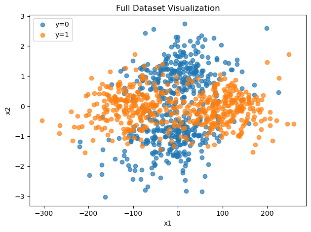
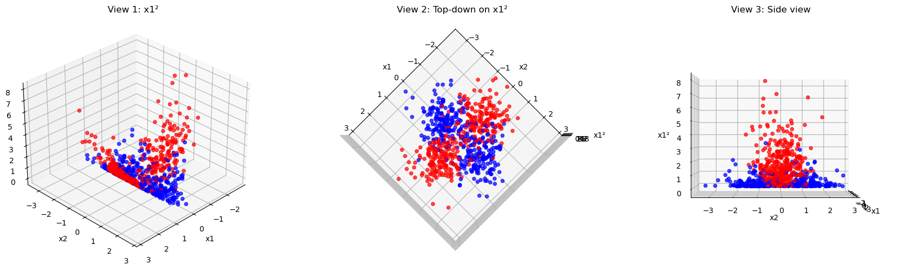
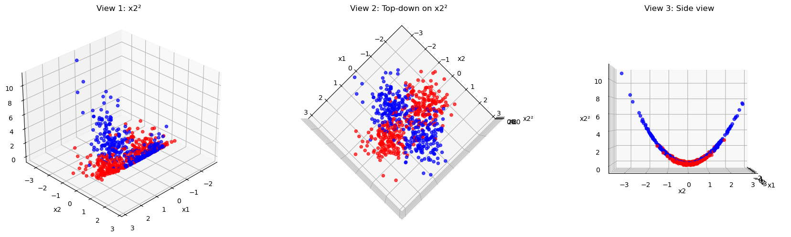
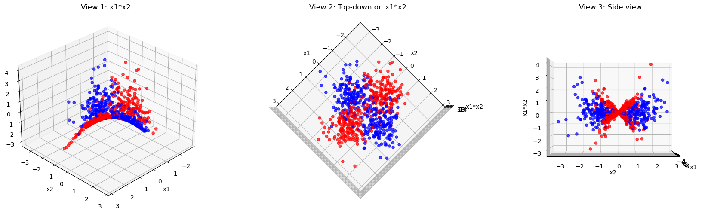
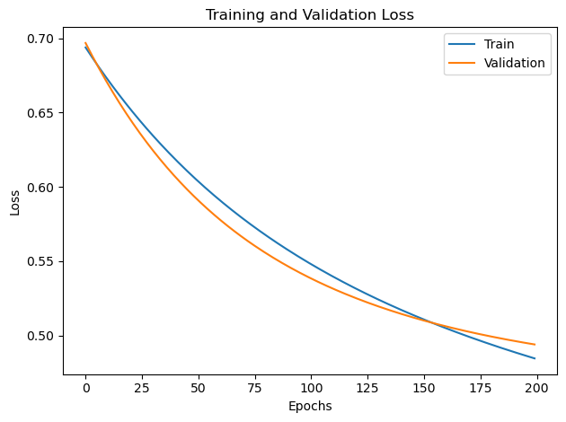
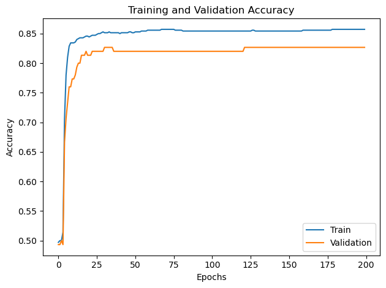

# Logistic Regression From Scratch: Non-Linear Classification with Python (Numpy)

This repository contains an academic project developed as part of the **Machine Learning** course at **Heinrich Heine University Düsseldorf**.

The core of this project is the implementation of a **Logistic Regression** model entirely **from scratch** using **Python and NumPy**, without relying on high-level machine learning or deep learning libraries/frameworks (like Scikit-learn, TensorFlow, or PyTorch). The goal was to build the model's fundamental components (Sigmoid function, Binary Cross-Entropy Loss, Gradient Descent, and L2 Regularization) manually. The solution then utilizes **Feature Engineering** (polynomial features) to transform a non-linearly separable 2D dataset into a higher-dimensional space where a linear decision boundary can be found.

The entire implementation, including the model functions, hyperparameter tuning, and training process, is documented in the `notebooks/project.ipynb` file.

***

---

## 💾 Dataset Visualization and Feature Engineering

The original dataset is composed of two features ($\mathbf{x_1}$ and $\mathbf{x_2}$) and two classes ($\mathbf{y=0}$ and $\mathbf{y=1}$).

### Original 2D Scatter Plot
The initial visualization confirms that the classes are concentrically distributed and heavily mixed, confirming they are **not linearly separable** by a straight line.



---

### Selected Feature Transformation

To enable the linear Logistic Regression model to classify the non-linear data, the features were augmented with quadratic polynomial terms.

The final model uses the following selected features:
$$\text{Final Feature Set} = \{\mathbf{x_1}, \mathbf{x_2}, \mathbf{x_1^2}, \mathbf{x_2^2}\}$$

### Analysis of 3D Polynomial Feature Transformations

To find a hyperplane that separates the classes, the original features were augmented, and the resulting 3D scatter plots were analyzed. The goal is to find a dimension that vertically separates the blue and red points.

#### 1. Transformation: $\mathbf{x_1^2}$
**(Features: $\mathbf{x_1, x_2, x_1^2}$)**

This transformation pulls points away from the $x_1$ axis (horizontal spread). However, the classes remain heavily mixed near the center, indicating that $\mathbf{x_1^2}$ alone is **insufficient** for clear linear separation.



#### 2. Transformation: $\mathbf{x_2^2}$ (Most Promising)
**(Features: $\mathbf{x_1, x_2, x_2^2}$)**

This transformation pulls points away from the $x_2$ axis (vertical spread). The **Side View (View 3)** shows a clear separation: the red class ($\mathbf{y=1}$) clusters near the bottom ($\mathbf{x_2^2 \approx 0}$), while the blue class ($\mathbf{y=0}$) is pushed higher. This suggests $\mathbf{x_2^2}$ is a **highly effective** separating feature.



#### 3. Transformation: $\mathbf{x_1 \times x_2}$
**(Features: $\mathbf{x_1, x_2, x_1x_2}$)**

This term introduces a **saddle shape** to the data. While it separates points along the diagonal axes, the classes remain significantly overlapping near the origin, meaning a horizontal plane **cannot** separate the data effectively.



---

### Final Feature Selection Justification

Based on the analysis, the final feature set was chosen as:
$$\text{Final Feature Set} = \{\mathbf{x_1}, \mathbf{x_2}, \mathbf{x_1^2}, \mathbf{x_2^2}\}$$

* **Inclusion of $\mathbf{x_1^2}$ and $\mathbf{x_2^2}$:** The original data shows a **concentric (circular/elliptical)** separation. An elliptical decision boundary is defined by a linear combination of squared terms ($\mathbf{w_1x_1^2 + w_2x_2^2 = c}$). Including both terms allows the model to find the optimal elliptical boundary, which is superior to relying on just $\mathbf{x_2^2}$ (which forces a two-parallel-line boundary).

* **Exclusion of $\mathbf{x_1x_2}$:** The interaction term $\mathbf{x_1x_2}$ is used to create **rotated** or **hyperbolic** boundaries. Since the concentric pattern is largely unrotated, this term was determined to be unnecessary for the final model and was dropped to maintain lower complexity, leading to better generalization.

---


---

## ⚙️ Final Model Configuration and Performance

The final model was trained with the chosen feature set and the best hyperparameters found via cross-validation.

### Final Hyperparameters

| Parameter | Value |
| :--- | :--- |
| **Feature Set** | $\mathbf{x_1, x_2, x_1^2, x_2^2}$ |
| **Learning Rate ($\mathbf{lr}$)** | 0.01 |
| **Regularization ($\mathbf{\lambda}$)** | 0.0 |
| **Epochs** | 200 |

### Final Metrics

The **minimum** required test accuracy is $73\%$.

| Dataset | Loss | Accuracy |
| :--- | :---: | :---: |
| **Train** | 0.4847 | 85.7% |
| **Validation** | 0.4941 | 82.7% |
| **Test** | N/A | **76.67%** |

### Final Weights and Bias

The decision boundary in the 4D feature space is defined by the following learned parameters:

$$\mathbf{W} = [\mathbf{0.01087}, \mathbf{0.00044}, \mathbf{0.45523}, \mathbf{−0.43087}]$$
$$\mathbf{b} = \mathbf{-0.00885}$$

---

### Training Curves

The plots below show the loss and accuracy curves over the 200 epochs, demonstrating stable convergence.

#### Loss Curve:


#### Accuracy Curve:


---

## 📦 Project Structure

```text
logistic-regression-project/
|
├── data/
│   └── dataset.csv
|
├── figures/
│   ├── accuracy_curve.png           # Final accuracy curve
│   ├── loss_curve.png               # Final loss curve
│   ├── original_2d_plot.png         # Original 2D Plot
│   ├── x1_squared_3d_plot.png       # x1^2 3D Plot
│   ├── x1x2_squared_3d_plot.png     # x1*x2 3D Plot
│   └── x2_squared_3d_plot.png       # x2^2 3D Plot
|
├── notebooks/
│    └── project.ipynb            # Main implementation notebook
│      
├── .gitignore
├── README.md
├── environment.yml
├── requirements.txt
```

## 💻 Setup and Usage

To set up the environment and replicate the results:

1.  **Clone the repository:**
    ```bash
    git clone <repository-url>
    cd logistic-regression-project
    ```

2.  **Install dependencies:**

    * **Option 1: Conda Environment (Recommended):**
        ```bash
        conda env create -f environment.yml
        conda activate ml-project1
        ```
    * **Option 2: Pip Installation:**
        ```bash
        pip install -r requirements.txt
        ```

3.  **Run the analysis:**
    Launch the Jupyter environment and execute all cells in `notebooks/project.ipynb` to load the data, train the model, and calculate the final test accuracy.
    ```bash
    jupyter notebook notebooks/project.ipynb
    ```